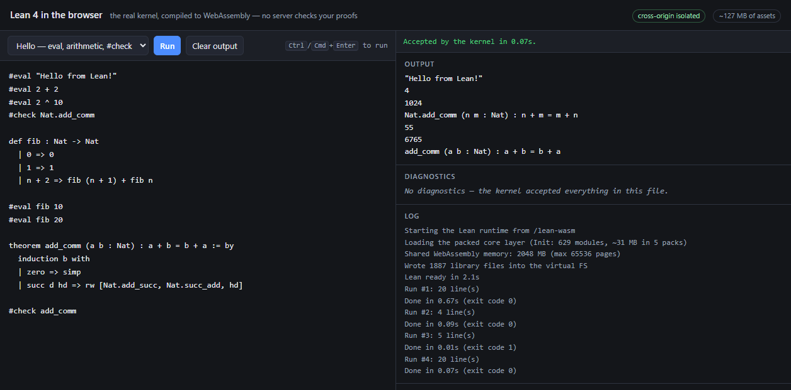

# Browser Lean

Run **Lean 4 entirely in the browser** — no server, no upload, no install. The real Lean elaborator
and kernel are compiled to WebAssembly, so a proof typed into the page is checked in that tab, on
your machine.

This is a proof of concept for adding a `lean` language to [LiveCodes](https://livecodes.io), in the
same shape as [`browser-cobol`](https://github.com/live-codes/browser-cobol),
[`browser-haskell`](https://github.com/live-codes/browser-haskell) and
[`browser-elixir`](https://github.com/live-codes/browser-elixir) were for their languages.



It is fast enough to use: the runtime is ready **~2.2 s** after the first Run, and a proof is checked
in **~0.3 s**.

```
Lean 4 source
  → real Lean 4 (cauli/lean4 `reinstate-wasm` fork, wasm32)   elaborate + kernel-check
  → JSON messages, one per line, on stdout                    severity: information | error
  → the page splits them by severity                          output / diagnostics
```

The runtime lives in a **persistent Web Worker** that imports Init once and then compiles repeatedly
through the fork's `lean_wasm_compile` export, reusing the environment it has already imported. The
library ships as **5 packed gzip files** (629 modules, 1,887 `.olean`/`.ir` files) rather than ~1,900
individual requests.

The Lean WASM artifacts are built by [cauli/lean4-wasm-in-browser](https://github.com/cauli/lean4-wasm-in-browser)
(Apache-2.0) — the reference implementation for this, and the source of the worker's structure and
the boot sequence. Credit for making Lean run well in a browser belongs there.

## Demo

```bash
npm run assets          # mirror ~127 MB of Lean artifacts into public/lean-wasm/ (once)
npm run assets:libs     # optional: Std/Lean/Batteries for lazy imports (~377 MB)
npm run assets:mathlib  # optional: the Mathlib layer (~316 MB compressed)
npm start               # → http://localhost:8129/
```

Pick an example (or type your own), press **Run** — or `Ctrl`/`Cmd` + `Enter` in the editor. Nothing
is downloaded until the first Run.

## Cross-origin isolation is required

**This page must be served with `Cross-Origin-Opener-Policy: same-origin` and
`Cross-Origin-Embedder-Policy: require-corp`.** `npm start` does that. Served without them, Run
reports

```
SharedArrayBuffer is unavailable, so the Lean runtime cannot start.
```

and downloads nothing.

That requirement is real, not a misdiagnosis. `lean.wasm` imports a WebAssembly memory with limits
flags `3` — `has-max | shared` — min 1024 pages, max 65536 pages (4 GiB). A `shared` memory can only
be constructed with a `SharedArrayBuffer`, which browsers expose only to a cross-origin isolated
document. There is no shim and no fallback.

**Chrome has two escape hatches that skip the headers entirely**: a reverse origin trial for
`SharedArrayBuffer` that has already been extended more than once and sits on a deprecation path, and
`Document-Isolation-Policy`, which lets a document isolate itself regardless of the page around it.
Both are Chrome-only and can be withdrawn — so Lean *could* ship in LiveCodes behind one of them, but
the durable answer is a single-threaded build. See [FINDINGS.md](FINDINGS.md) §2.

To see the failure for yourself:

```bash
npm run start:no-isolation   # same page, no COOP/COEP
```

## What you get

- **Client-side checking.** Nothing is uploaded; the verdict on your proof comes from a wasm module in
  the tab.
- **Real diagnostics, with positions** — `error: Tactic \`rfl\` failed: The left-hand side 1 is not
  definitionally equal to the right-hand side 2` / `⊢ 1 = 2  (line 1, col 32)`.
- **`#eval`, `#check`, `#print`**, user-defined recursion, and **`#eval` of library functions** —
  `#eval (List.range 5).map (fun n => n * n)` prints `[0, 1, 4, 9, 16]`.
- **Core tactic proofs** (`induction`, `rw`, `simp`).
- **A clean split** between program output and diagnostics, even though the runtime puts both on
  stdout ([FINDINGS.md](FINDINGS.md) §3).
- **Lazy loading**: the page is three small files; the 127 MB of artifacts wait for the first Run.

## Verified

Each row was run through the page in headless Chrome and the panes read back.

| snippet | output | exit | run |
| --- | --- | --- | --- |
| `#eval "Hello from Lean!"` | `"Hello from Lean!"` | 0 | — |
| `#eval 2 + 2`, `#eval 2 ^ 10`, `#check Nat.add_comm` | `4`, `1024`, `Nat.add_comm (n m : Nat) : n + m = m + n` | 0 | — |
| `def fib` + `#eval fib 10` / `#eval fib 20` | `55`, `6765` | 0 | 0.28 s |
| `theorem add_comm … := by induction b with …` | accepted, no diagnostics | 0 | 0.28–0.67 s |
| `#eval (List.range 5).map (fun n => n * n)` | `[0, 1, 4, 9, 16]` | 0 | 0.08 s |
| `#check this_is_not_defined` | `error: Unknown identifier \`this_is_not_defined\` (line 1, col 6)` | 1 | 0.01 s |
| `theorem t : (1 : Nat) = 2 := by rfl` | `error: Tactic \`rfl\` failed: … (line 1, col 32)` | 1 | 0.03 s |
| `import Std.Data.HashMap` + `#eval` a `HashMap` fold | `[(1, 1), (2, 2), (3, 3)]` | 0 | 0.20 s |
| `import Lean` + `#eval (Name.mkSimple "hello").toString` | `"hello"`, `Lean.Expr : Type` | 0 | 0.02 s |
| `import Batteries` | accepted | 0 | 5.5 s first time, then 0.1 s |
| `import Mathlib.Data.Real.Basic` + `Mathlib.Tactic.Ring`, `example (x : ℝ) : x + 0 = x := by ring` | accepted, `#check Real` → `Real : Type` | 0 | 10.4 s first time, then 2.6 s |
| `Mathlib.Tactic.NormNum` + `Linarith` proofs on `ℚ` and `ℝ` | accepted | 0 | 2.6 s (warm) |
| `import Mathlib.Analysis.SpecialFunctions.Sqrt` (outside the closure) | `object file '…/Sqrt.olean' … does not exist` + a note | 1 | 0.2 s |

Runtime ready in **2.2 s**. Compiles are milliseconds to a few hundred milliseconds, and get faster
as the imported environment is reused.

Capability handling was checked in all three configurations a host can present:

| served as | `SharedArrayBuffer` | behaviour |
| --- | --- | --- |
| with COOP/COEP (`npm start`) | present, isolated | boots; the runs above |
| without headers (`npm run start:no-isolation`) | absent | refuses with a clear message, downloads nothing |
| simulated origin trial (global present, document not isolated) | present, not isolated | attempts to boot, and reports a stalled boot rather than hanging |

## Assets

| asset | bytes |
| --- | --- |
| `lean.wasm` | 100,838,905 (96.17 MiB) |
| core layer, 5 packs (629 modules, 1,887 files) | 32,184,975 (30.69 MiB) |
| `core-layer.json` | 313,732 |
| `lean.js` | 148,402 |
| **on disk** | **~127 MiB** |

Over the wire it is far less: the wasm is brotli-compressed in transit (96.17 MiB → **16.1 MB**), and
the packs are already gzip, so a first load transfers roughly **47 MB**.

`npm run assets` mirrors the pinned build. The artifacts are **not committed**; they are fetched from
a third-party deploy because they cannot be hotlinked — see [FINDINGS.md](FINDINGS.md) §5, which also
explains why the version must be pinned (`?v=`) and how a mismatch shows up.

`npm run assets:libs` separately mirrors the optional libraries used by lazy imports: **5,598 files,
~377 MiB**, being `.olean` + `.ir` + `.ir.sig` for each of 1,866 modules (Std, Lean, Batteries).

`npm run assets:mathlib` mirrors the Mathlib layer: `real-analysis-layer.json` plus **52 packs,
316.3 MiB compressed** (809.8 MiB once installed — 12,909 files, 4,303 modules).

## Libraries

`Init` is always available. **`Std`, `Lean` (metaprogramming) and `Batteries` are loaded on demand** —
write the import and it works:

```lean
import Std.Data.HashMap

def counts (xs : List Nat) : Std.HashMap Nat Nat :=
  xs.foldl (fun m x => m.insert x ((m.getD x 0) + 1)) {}

#eval (counts [1, 2, 2, 3, 3, 3]).toList   -- [(1, 1), (2, 2), (3, 3)]
```

When Lean reports a missing module the page fetches that library, installs it into the virtual
filesystem mid-session and recompiles — so the **first** use of a library costs a fetch and every run
after it is milliseconds. Nothing is loaded unless you import it.

The closure is discovered by asking the compiler rather than by parsing `.olean` dependency headers:
Lean's `unknown module prefix 'X'` names exactly what is absent, so the page loads `X` and tries
again. `import Batteries` therefore pulls in whatever Batteries itself needs.

Imports are read from your program, so **the number of imports does not multiply the work**: eight
imports from Std cost one load and one compile, not eight. Only transitive dependencies need extra
rounds, and there are only three libraries to discover, so a program is never more than a few rounds
from working. Measured: 8 imports across the three libraries → 1 compile; `import Batteries` alone on a
cold page → 3 compiles (Batteries → Lean → Std).

Upstream ships these as individual files, not packs — `lean-lib-files.json` indexes 2,658 modules and
there is no `std-layer.json`, because packing is a startup optimisation for the Init closure only.
`npm run assets:libs` mirrors that tree for the three libraries (5,598 files, ~377 MiB, gitignored).

**Mathlib works — as a 4,303-module closure.** Upstream publishes Mathlib only as a *packed layer*, the
closure its Real Analysis game needs, so `npm run assets:mathlib` mirrors it (~316 MiB compressed,
809.8 MiB installed) and this works:

```lean
import Mathlib.Data.Real.Basic
import Mathlib.Tactic.Ring

example (x : ℝ) : x + 0 = x := by ring
```

`norm_num` and `linarith` work too. Two things to know:

- **There is no umbrella `Mathlib` module.** `import Mathlib` alone is not a Lean module and never was
  — import specific ones, as you would in a Lean project.
- **It is a closure, not all of Mathlib.** `Mathlib.Analysis.SpecialFunctions.Sqrt`, for example, is not
  in it. A module outside the closure fails with `object file '…' of module … does not exist`, and the
  page notes that this is the published closure rather than a mistake. Upstream deliberately does not
  ship full Mathlib: a complete environment snapshot was tested and rejected because compaction
  exceeded the practical wasm heap.

Without the mirrors these imports fail with a note naming the command to run — `npm run assets:libs`
for Std/Lean/Batteries, `npm run assets:mathlib` for Mathlib. See [FINDINGS.md](FINDINGS.md) §5.

## Limitations

- **Syntax errors are silently accepted.** `def broken : Nat :=` and `#eval (1 +` report nothing at
  all — empty stdout, empty stderr — and the page says "accepted". Elaboration and kernel errors *are*
  reported normally. This is a gap in the fork's compile entry, not in the page; it is worth
  reporting upstream. See [FINDINGS.md](FINDINGS.md) §6.
- **Mathlib here is a 4,303-module closure, not Mathlib.** Some modules (`Mathlib.Analysis.SpecialFunctions.Sqrt`)
  are absent; the page says so when you hit one. There is no umbrella `Mathlib` module either.
- **The Mathlib layer is heavy**: ~316 MB to mirror and 809.8 MiB installed once loaded, on top of the
  other libraries. It is fetched only when something imports it.
- **The optional libraries need their own mirror.** Without `npm run assets:libs` or
  `npm run assets:mathlib`, the corresponding imports fail with a note naming the command to run.
- **Cross-origin isolation is mandatory**, with no fallback. A stub `SharedArrayBuffer` does not help
  here (unlike the trick `browser-cobol` documented): this runtime really constructs one for its pthread
  pool, so a fake passes the type check and then wedges the boot.
- **A stalled boot is reported, not hung on.** If the module instantiates but never finishes starting,
  the page fails after 60 s of silence with an explanation instead of sitting on "loading" forever.
- **No way to interrupt** a non-terminating elaboration; recovery is a page reload (~2 s).
- **~127 MiB of mirrored assets** (≈47 MB over the wire), fetched once.
- **Chrome only, as tested.** Safari, Firefox and mobile were not exercised.

## Not yet a LiveCodes language

Much better positioned than earlier attempts, but not shippable as-is, for one reason — and it is a
trade-off rather than a wall.

A LiveCodes result page runs in a sandboxed iframe inside *someone else's* document, and cross-origin
isolation is inherited from the top-level document, so it cannot give itself COOP/COEP. On any browser
other than Chrome this runtime therefore has no `SharedArrayBuffer` and cannot start. Chrome-only
escape hatches exist (the reverse origin trial for `SharedArrayBuffer`, or `Document-Isolation-Policy`),
so Lean *could* ship behind one of them — acceptable, but they can be withdrawn and they help nobody
else. Two ways forward, in preference order:

1. **A single-threaded Lean wasm build.** No isolation, no trial, works everywhere, and removes the
   question entirely. This is a build-and-release task.
2. **Ship Chrome-only behind the origin trial**, keeping the feature detection the page already has:
   where `SharedArrayBuffer` is missing, the language should say so plainly rather than fail obscurely.

Everything else is now in place: a single long-lived Worker per page, ~0.3 s compiles, `#eval` of
library functions working, and static assets that can be hosted anywhere. [FINDINGS.md](FINDINGS.md)
§7 has the `lang-lean` shape that would follow, and notes which parts of `public/main.js` carry over
almost unchanged.

## Layout

```
public/index.html      the page: examples, editor, output, diagnostics, log
public/main.js         the driver: worker protocol, progress, message classification, dataset state
public/lean-worker.js  the Lean runtime host (persistent Worker; adapted from upstream, Apache-2.0)
scripts/fetch-assets.mjs  mirrors the pinned artifacts into public/lean-wasm/
serve.js               static server: COOP/COEP on by default, --no-isolation to compare
FINDINGS.md            the spike log: what was measured, what breaks, what it means
lean-run.png           screenshot of a verified run
```

There is no bundler and no `node_modules`.

## Verifying

| what | command |
| --- | --- |
| mirror the artifacts | `npm run assets` |
| serve the page | `npm start` → http://localhost:8129/ |
| see the isolation failure | `npm run start:no-isolation` |
| syntax-check | `npm run check` |

The page exposes `document.documentElement.dataset` (`status`, `stage`, `runs`, `isolated`,
`exitCode`, `initMs`, `runMs`) and its element ids as globals, so a headless probe can drive it
without string literals. `window.__raw` holds the last run's unclassified stdout/stderr.

## Packaging and hosting

The page is **code, not assets**: `public/` is ~30 KB, and everything else is mirrored and gitignored.
So a package can ship the code and let the assets come from a CDN. Three base URLs are configurable:

| what | query param | default | size |
| --- | --- | --- | --- |
| binaries + core layer (`lean.js`, `lean.wasm`, `core-layer.json` + packs) | `?baseUrl=` | `/lean-wasm` | 96.4 MiB |
| per-file libraries (index + Std/Lean/Batteries) | `?libBase=` | `/lean-lib` | 377 MiB |
| packed layers (Mathlib) | `?layerBase=` | `/lean-mathlib` | 316 MiB |

Upstream's **library data is already CORS-enabled** (`Access-Control-Allow-Origin: *`), so the 347 MiB
of packs and `.olean` files could be fetched from `lean.cau.li` with no hosting. **The two binaries are
not** — they are served through a Cloudflare Function with `Cross-Origin-Resource-Policy: same-origin`
and no CORS — and they are the only part that must be hosted deliberately.

`lean.wasm` is 96.2 MiB, which rules out the obvious free CDNs:

- **jsDelivr** has a 20 MB *per-file* limit on top of the 150 MB package limit, so the wasm cannot be
  served there at all (the 5 core packs, ~6 MB each, would fit).
- **GitHub Releases** send no `Access-Control-Allow-Origin` (and `Content-Disposition: attachment`).
- **GitHub Pages** does send `*` and would hold the file under its 100 MiB limit, but is not intended as
  a CDN and has a soft 100 GB/month bandwidth cap.

**Cloudflare R2 / B2 / Bunny** (96 MB stored is cents per month; egress free on R2) — or asking upstream
to add the header — is the way to host the binaries. Full audit, including the `HEAD`-vs-`GET` trap that
makes this look the opposite of what it is, in [FINDINGS.md](FINDINGS.md) §5.

## Status

Spike complete. The page runs Lean 4 client-side, verified end to end in headless Chrome for
accepted proofs, rejected proofs and library `#eval`, with the isolation failure reproduced and the
silent-parse-failure gap characterised. Not yet suitable as a LiveCodes language, for the one
measured reason above.

Next: a single-threaded build, and mirroring the artifacts somewhere we control.

## License

MIT © Hatem Hosny. The Lean compiler and its libraries are Apache-2.0 (Lean project); the WASM
artifacts and the worker's structure come from
[cauli/lean4-wasm-in-browser](https://github.com/cauli/lean4-wasm-in-browser) (Apache-2.0). See
[LICENSE](LICENSE).
